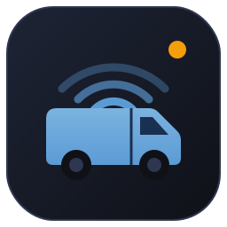

  

# FleetOS - Claude Code & Agents Workshop

Your company runs three legacy fleet-management systems built over fifteen
years: **FleetTracker** (vehicle telemetry, Python/Flask), **MaintenanceManager**
(service scheduling, assorted scripts), and **FleetReports** (BI dashboards,
spreadsheets and VBA). They overlap, contradict each other, and nobody fully
understands all three. These challenges focus on consolidating them
into a single modern platform: **FleetOS**.

These challenges put you on the FleetOS team with Claude Code as your pair. Each challenge builds on top of the last.

## The challenges

| Folder | Level | Time | What you build |
|---|---|---|---|
| [`1_dashboard/`](1_dashboard/) | Beginner | ~1-2 h | Prototype the FleetOS dashboard. Fix bugs, add a feature, package a design-system skill, and extend the dashboard with you're creativity! |
| [`2_code_modernisation/`](2_code_modernisation/) | Intermediate | ~1-2 h | Rescue business logic from the legacy FleetTracker Flask app and refactor one slice into a modern FastAPI service. |
| [`3_loops/`](3_loops/) | Intermediate | ~1-1.5 h | Engineer loops: hand off the check, the stop condition, the trigger, then the whole prompt - and watch FleetOS run its own go-live morning while you get a coffee. |
| [`4_team_scale/`](4_team_scale/) | Advanced | ~1 h | Configure Claude Code for a team: govern permissions with `settings.json`, build parallel subagents with scoped tools, enforce rules with hooks, package it all as a sharable plugin, and run it headless. |
| [`5_agents/`](5_agents/) | Advanced (bonus) | ~2 h | Build a Fleet Operations Agent with the Agent SDK: wrap the API and a SQLite ops database as MCP tools, write the weekly briefing, fan out into sub-agents, and surface the output on the dashboard. |

Each challenge folder contains a `README.md` file. This file contains the setup and step-by-step instructions of the challenge.

## Work through each challenge

The challenges build on each other thematically, but every folder is
self-contained. Each `starter/` directory has everything you need to begin.
There is also a `solutions/` directory which has a finished reference for each challenge -
peek if you're stuck. Where a challenge uses a previous challenge's output
(the dashboard, the API), a ready-made copy is bundled in the folder so you
never need to have completed the earlier one. However, feel free to copy your
dashoard from challenge 1 into the later challenges! Similarly feel free to
copy your API from challenge 2 into challenges 3 & 4 also!

Now let's get to work building FleetOS! **Head over to `1_dashboard/README.md` to get started!**

> 📝 **Note:** Prefer to start with Challenge 2 or 3? Feel free - each challenge is designed to stand alone.