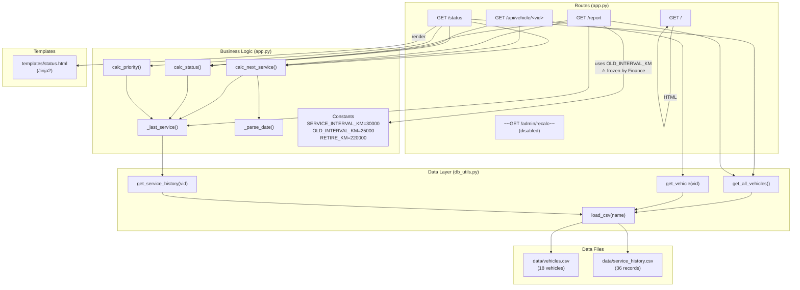

# FleetTracker Component Diagram

```mermaid
graph TD
    subgraph routes["Routes (app.py)"]
        R1["GET /"]
        R2["GET /status"]
        R3["GET /api/vehicle/&lt;vid&gt;"]
        R4["GET /report"]
        R5["~~GET /admin/recalc~~\n(disabled)"]
    end

    subgraph logic["Business Logic (app.py)"]
        F1["calc_next_service()"]
        F2["calc_status()"]
        F3["calc_priority()"]
        F4["_last_service()"]
        F5["_parse_date()"]
        K1["Constants\nSERVICE_INTERVAL_KM=30000\nOLD_INTERVAL_KM=25000\nRETIRE_KM=220000"]
    end

    subgraph data["Data Layer (db_utils.py)"]
        D1["get_all_vehicles()"]
        D2["get_vehicle(vid)"]
        D3["get_service_history(vid)"]
        D4["load_csv(name)"]
    end

    subgraph files["Data Files"]
        CSV1["data/vehicles.csv\n(18 vehicles)"]
        CSV2["data/service_history.csv\n(36 records)"]
    end

    subgraph ui["Templates"]
        T1["templates/status.html\n(Jinja2)"]
    end

    R1 -->|HTML| R1
    R2 --> D1
    R2 --> F1
    R2 --> F2
    R2 --> F3
    R2 -->|render| T1

    R3 --> D2
    R3 --> F1
    R3 --> F2

    R4 --> D1
    R4 --> F4
    R4 --> F1
    R4 --> F2
    R4 --->|"uses OLD_INTERVAL_KM\n⚠ frozen by Finance"| K1

    F1 --> F4
    F1 --> F5
    F2 --> F4
    F3 --> F4
    F4 --> D3

    D1 --> D4
    D2 --> D4
    D3 --> D4

    D4 --> CSV1
    D4 --> CSV2
```
